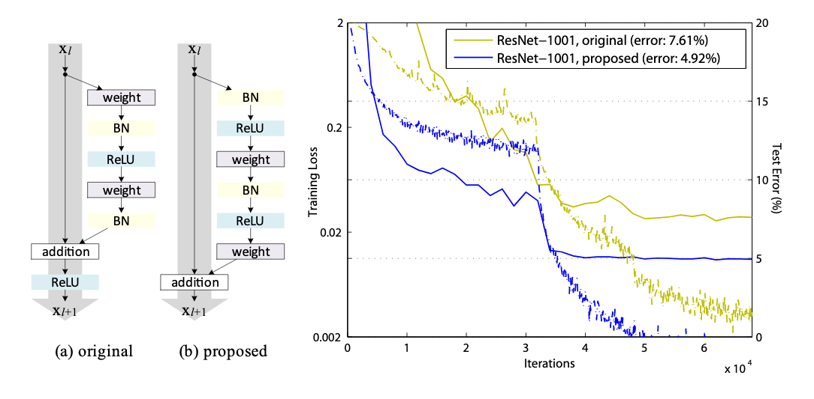

# csharnn
Three words: hackathon, OCR, EAST =)

## Content
* [Credits](#credits)
* [Description](#description)
* [Todoist](#todoist)
* [Notes](#notes)

## Description
- written in Keras
- end-to-end CRNN model that follows
    | Feature Extraction | Transform Layers | Sequence Labeling    | Loss                    |
    | ------------------ | ---------------- | -------------------- | ----------------------- |
    | ResNet50/Darknet53 | STN/FC layers    | biLSTM/AttentionLSTM | CTC/Joint CTC-Attention |
- Feature Extraction (_refers to [feature_extraction.py](feature_extraction.py)_)
  - [ResNet50v2](../paper/1603.05027.pdf)
    - 
    -  Using pre-activation weight to address faster convergence when scaling the number of layers for each model

## Todoist
* ~~__URGENT__: Improve runtime for linking different file~~
* [x] nmt dataset (_finished on feb 14_)
* [x] construction of SHA-RNN (_finished on feb 14_)
* [x] construction of YOLO (_finished on march 24_)
* [x] Chain up them models for bigger chain (_finished on march 25_)
* [ ] Added CTC Loss

## Notes

## Credits
* [clovaai's deep-text-recognition-benchmark](https://github.com/clovaai/deep-text-recognition-benchmark)
